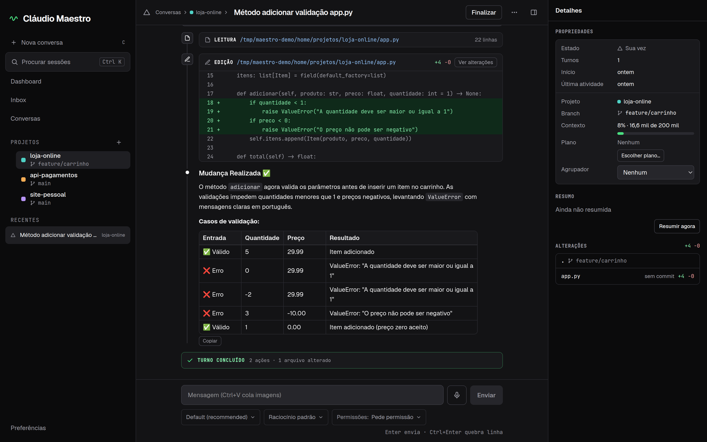
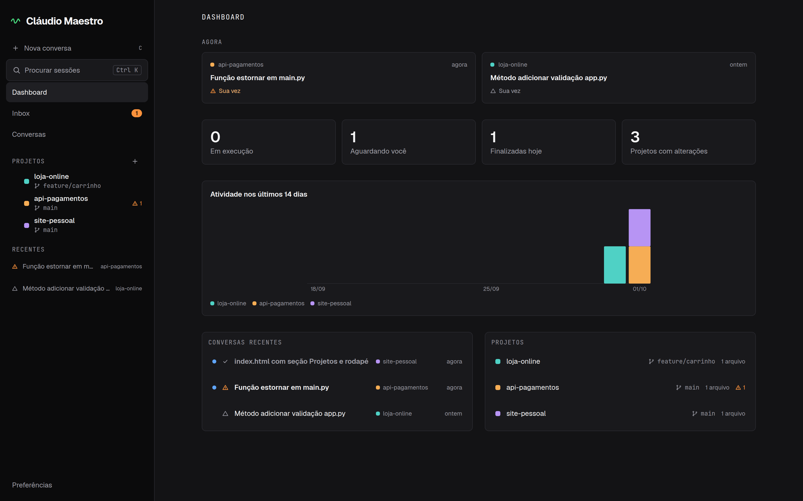

<p align="center">
  
</p>

# Cláudio Maestro

**Um só regendo todos os seus projetos.**

O Cláudio Maestro é um app web local para acompanhar e conduzir várias sessões do Claude ao mesmo tempo, em projetos diferentes, numa tela só. Ele roda na sua máquina, abre no navegador e conversa com o Claude pelo [Claude Agent SDK](https://code.claude.com/docs/en/agent-sdk/overview) em Python.

Nasceu de dois incômodos: a extensão do VSCode é pesada e presa a um projeto por vez, e no terminal fica difícil ler diffs, saídas de comando e saber qual sessão está esperando por você.

## Sim, isto está em português

Não, não foi engano do tradutor. O Cláudio é brasileiro: a interface é em português, a documentação também, e assim vai continuar. Aqui se escreve "commitar" sem culpa, se toma um cafezinho enquanto o agente roda os testes e se considera deploy na sexta-feira uma falta de amor-próprio.

Se você não lê português, o tradutor do navegador dá conta, e o próprio Claude também. Pull requests de quem chegou pelo tradutor são muito bem-vindos.

## O que ele faz

- **Todos os projetos numa tela.** Menu lateral com cada projeto, suas branches e suas conversas.
- **Estado de relance.** Cada conversa está rodando, esperando você ou finalizada, com ícone próprio além da cor. O que pede a sua atenção aparece primeiro.
- **Leitura confortável.** Respostas em markdown, o diff de cada edição, comandos com a saída, tabelas e blocos de código legíveis.
- **Você decide pela interface.** Permissões (permitir uma vez, sempre ou negar), perguntas do Claude e aprovação de planos. O pedido para editar mostra o diff, e "Permitir sempre" diz a regra que vai ser gravada.
- **Triagem pelo teclado.** Na Inbox, `j`/`k` movem, `Enter` abre, `a` permite e `d` nega, sem abrir cada conversa.
- **Notificações do sistema.** O navegador avisa quando uma conversa pede permissão, faz uma pergunta ou traz um plano (ligue em Preferências → Notificações).
- **Git sempre à vista.** A branch de cada repositório do projeto, inclusive worktrees, e as alterações de cada conversa. O app busca a branch remota a cada 5 minutos e avisa quando há commits para baixar.
- **Continuidade com o CLI.** As conversas ficam em `~/.claude/projects`, como no CLI e na extensão. Dá para retomar no Maestro uma conversa começada no terminal, e vice-versa.
- **Controles por conversa.** Modelo, nível de raciocínio, modo de permissão, imagens coladas, comandos `/` e menções `@`.
- **Resumo das conversas.** Um agente do próprio app pode resumir em fases o que cada conversa em andamento já fez.
- **Resumo ao voltar.** Ao reabrir uma conversa depois de um tempo, um card mostra o que aconteceu enquanto você estava fora e o que falta.

O que ele não é, de propósito: IDE, terminal embutido, editor de código ou árvore de arquivos.

<p align="center">
  
</p>

## Requisitos

- Linux ou macOS (no Windows não foi testado)
- [Python 3.13](https://www.python.org/) e [uv](https://docs.astral.sh/uv/)
- [Node 22.12 ou mais novo](https://nodejs.org/) e [pnpm](https://pnpm.io/installation)
- git
- No Linux, o `zenity` (opcional) abre o seletor de pastas nativo. Sem ele, o app usa o navegador de pastas próprio
- [Claude Code](https://code.claude.com/docs) instalado e autenticado na máquina

## Instalação e uso

```bash
git clone https://github.com/vateiixeira/claudio-maestro.git
cd claudio-maestro
uv sync
pnpm --dir frontend install
uv run claudio-maestro
```

Abra **http://localhost:6660**.

Na primeira execução, e sempre que o frontend mudar (depois de um `git pull`, por exemplo), o comando compila o frontend antes de subir. Para usar outra porta: `uv run claudio-maestro --port 7000`.

As sessões continuam rodando quando o backend reinicia: um processo auxiliar (agentd) guarda os processos do agente. Para desligar isso, use `MAESTRO_AGENTD=0`.

Se você roda o backend sob um gerenciador de serviços que encerra o grupo de processos inteiro (o padrão do systemd, `KillMode=control-group`), o agentd cai junto com o backend e as sessões não sobrevivem. Use `KillMode=process` na unit, ou rode o backend de modo que o agentd continue vivo depois dele.

## Atualizar

O rodapé do menu lateral mostra a versão instalada e avisa quando sai uma versão nova, com as notas e estes comandos:

```bash
git pull
uv sync
pnpm --dir frontend install
```

Depois, pare o app (Ctrl+C) e rode `uv run claudio-maestro` de novo; o frontend é recompilado sozinho.

Se as notas da versão disserem que o agentd mudou, encerre-o também, o que derruba as sessões em andamento: `kill $(cat ~/.local/share/claudio-maestro/agentd-v1.lock)` (com `MAESTRO_DATA_DIR`, o arquivo fica nessa pasta). Ele volta sozinho na próxima vez que o app subir.

Para saber da versão nova, o app consulta a API do GitHub (`api.github.com`) um minuto depois de subir e uma vez por dia. A requisição só lê a última release; nada sobre seus projetos ou conversas é enviado. Para desligar, use `MAESTRO_UPDATE_CHECK=0`. Também dá para acompanhar pelo GitHub: **Watch → Custom → Releases**.

## Autenticação

O Cláudio Maestro não faz login e não guarda credenciais. Ele usa a autenticação que o Claude Code já tem na sua máquina, do mesmo jeito que o CLI usa.

A Anthropic orienta que produtos de terceiros feitos com o Agent SDK usem [autenticação por chave de API](https://code.claude.com/docs/en/agent-sdk/overview) (`ANTHROPIC_API_KEY`). Escolha a forma de autenticação de acordo com os termos que valem para a sua conta.

## Configuração

| Variável | Para quê | Padrão |
|---|---|---|
| `MAESTRO_PORT` | Porta do app (e do backend, no desenvolvimento) | `6660` |
| `MAESTRO_DEV_PORT` | Porta do Vite, no desenvolvimento | `6600` |
| `MAESTRO_PREVIEW_PORT` | Porta de um segundo Vite, para ver uma worktree em desenvolvimento usando o mesmo backend (veja o `CONTRIBUTING.md`) | desligada |
| `MAESTRO_HOME` | Limite do navegador de pastas; também muda a pasta de dados padrão (`$MAESTRO_HOME/.local/share/claudio-maestro`) | sua pasta pessoal |
| `MAESTRO_DATA_DIR` | Onde fica o banco SQLite (só metadados); vale mais que o `MAESTRO_HOME` | `~/.local/share/claudio-maestro` |
| `MAESTRO_AGENTD` | Com `0`, não inicia o agentd: as sessões novas só vivem enquanto o backend viver (as que já estão num agentd ativo continuam sendo religadas) | ligado |
| `MAESTRO_UPDATE_CHECK` | Com `0`, o app não consulta o GitHub para saber se há versão nova | ligado |
| `CLAUDE_CONFIG_DIR` | Pasta de configuração do Claude Code | `~/.claude` |

As portas precisam estar entre 1024 e 65535, fora de 6665 a 6669 (os navegadores bloqueiam essas). O app escuta só em `127.0.0.1`, sempre.

O comando que abre arquivos no editor (padrão: `code`) fica nas Preferências do app.

## Segurança

O app executa comandos na sua máquina pelo Claude, então qualquer site aberto no seu navegador é uma ameaça a ele. Por isso ele escuta só em `127.0.0.1`, recusa `Host` e `Origin` de fora, não libera CORS, exige um cabeçalho próprio em toda chamada à API e só aceita caminhos dentro dos projetos cadastrados.

Não exponha o app na rede. Detalhes e como relatar uma falha em [SECURITY.md](SECURITY.md).

## Limitações

- Interface só em português.
- Windows não testado.
- Acesso só local, por uma pessoa.

## Contribuindo

Veja [CONTRIBUTING.md](CONTRIBUTING.md). O que pode vir pela frente está no [ROADMAP.md](ROADMAP.md), e o que mudou em cada versão no [CHANGELOG.md](CHANGELOG.md).

## Licença

[MIT](LICENSE).

O Cláudio Maestro é um projeto independente. Não é afiliado, endossado nem patrocinado pela Anthropic. Claude é marca registrada da Anthropic, PBC.
